# 訂餐系統 - 安裝與執行說明書
這是一個基於 **Vue.js** 和 **Spring Boot** 開發的訂餐系統。

---

## 系統要求
- **資料庫**：MySQL（版本 8.0 或更高）
- **後端**：JDK 17、Maven 3.6+
- **前端**：Node.js 16+、npm

---

## 一、資料庫初始化
### 1. 下載 GitHub 中的 SQL 文件
1. 下載GitHub 儲存庫中，包含 SQL 文件的資料夾。
2. 保存到本地並記住文件路徑。

---

### 2. 將 SQL 文件導入 MySQL Workbench
#### **2-1. 建立資料庫連接**
1. 下載並打開 **MySQL Workbench**。 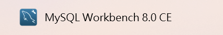

2. 點擊主界面中 **MySQL Connections** 旁的 `+` 號，創建新的資料庫連接。 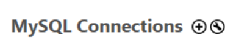
3. 在彈出的 **Setup New Connection** 視窗中：
   - **Connection Name**：輸入 `saddb`（或其他名稱）。.png)
   - **Connection Method**：選擇 `Standard (TCP/IP)`。
   - **Hostname**：輸入 `localhost`（本地連接）。
   - **Port**：默認為 `3306`，如有自定義端口，請輸入相應端口號。
   - **Username**：輸入您的 MySQL 用戶名（默認為 `root`）。
   - **Password**：點擊 **Store in Vault...**，然後輸入您的 MySQL 密碼。
4. 點擊 **Test Connection**，確保連接成功後，點擊 **OK** 來保存設置。

#### **2-2. 打開並執行 SQL 腳本**
1. 在 **MySQL Workbench** 中，點擊剛剛創建的連接（例如 `saddb`），進入資料庫管理界面。
2. 點擊頂部的 **File** 菜單，選擇 **Open SQL Script**。 .png)
3. 導航到下載的 SQL 文件路徑，選擇並打開 SQL 文件（例如：`schema.sql`）。
4. 點擊 **Execute** 按鈕執行 SQL 腳本。這將在資料庫中創建所有表結構和初始數據。

---

### 3. 資料庫初始化完成
至此，資料庫已成功設置，並可以與後端應用程序配合使用。

---

## 提示
- 如果在連接或執行過程中出現問題，可以檢查：
  - **MySQL 是否啟動**。
  - 用戶名和密碼是否正確。
  - MySQL 是否允許本地連接（檢查防火牆設置）。

---

## 二、設置前端架構
### 1. 下載 GitHub 中的前端文件
1. 下載GitHub 儲存庫中，front 資料夾內所有文件。
2. 保存到本地並記住文件路徑。

---

### 2. 將 front 文件導入 VSCode
#### **2-1. 建立 Vue 專案**
1. 至 **Node.js**官網下載並安裝Node.js
    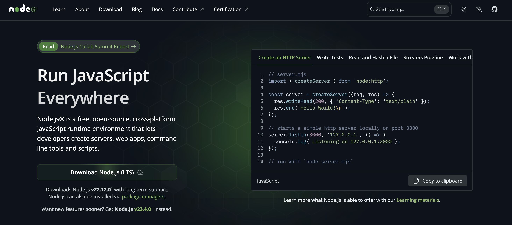
2. 開啟 Terminal 安裝 Vue CLI
   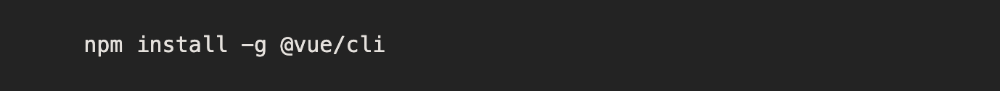
4. 繼續安裝 Vuex
   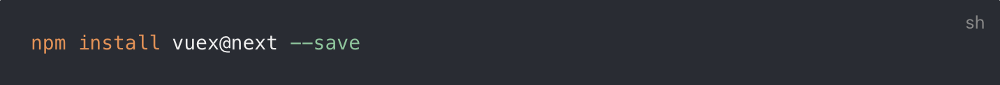
6. 繼續安裝 axios
   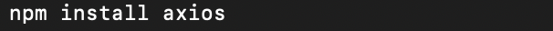
8. 透過 Vue CLI 在桌面建立專案
   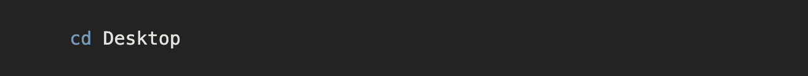
   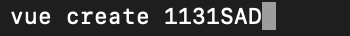
10. 選擇設定
    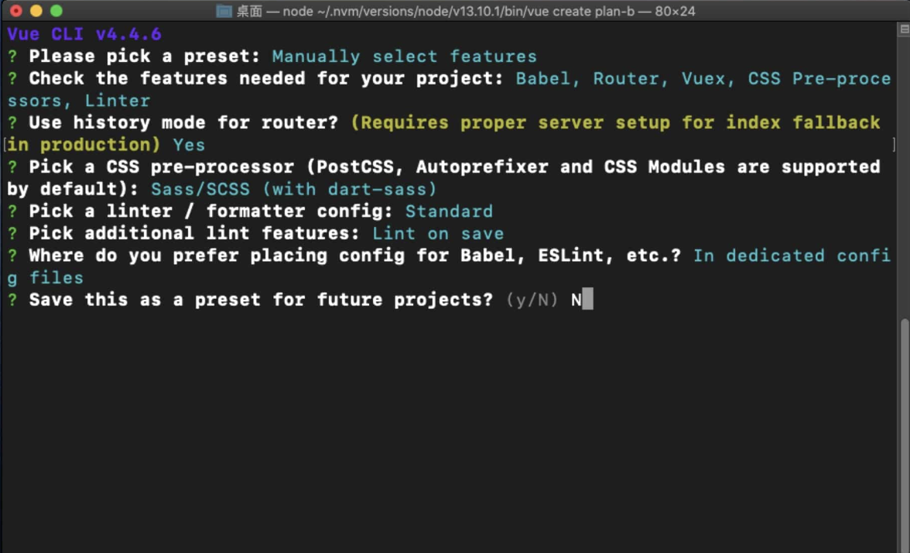
12. 用 VSCode 打開專案、匯入最初從 Github 中下載的文件
    
#### **2-2. 顯示網頁前端 **
1. 於 Terminal 中輸入 npm run serve 看專案是否可以使用
    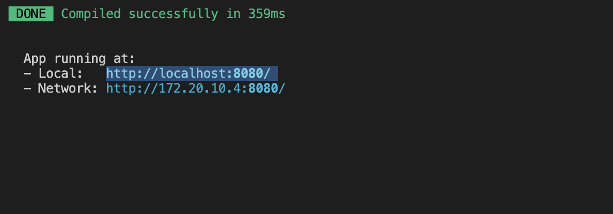
2. 複製網址到瀏覽器打開，出現畫面就代表成功囉！
    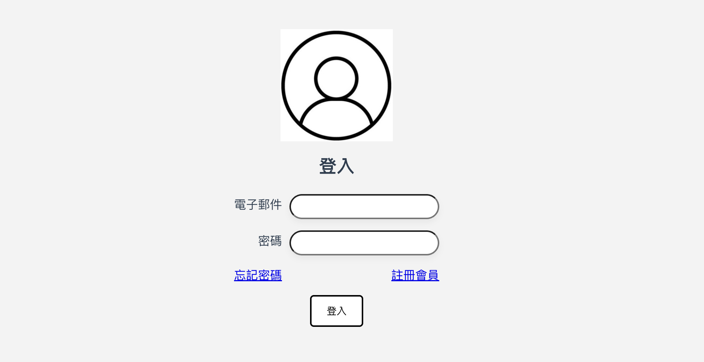
   
---

### 3. 前端設置完成
至此，網頁前端已成功設置，並可以與後端應用程序配合使用。

---

